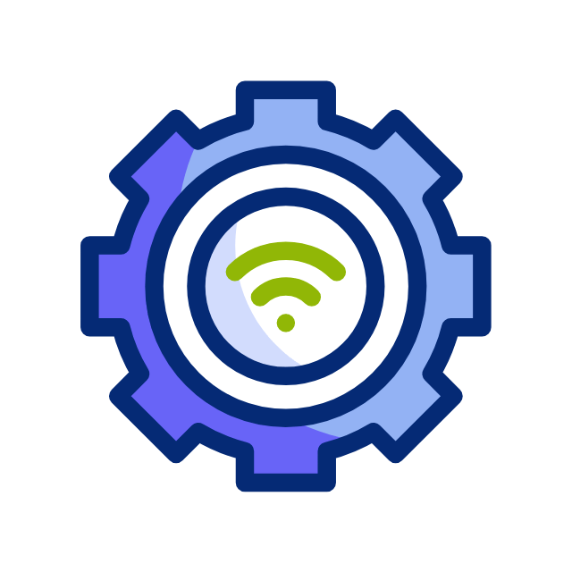

<b>Overview</b>
 
 
  This lab involved designing and physically building a small network in an in-person classroom environment. The goal was to understand core networking concepts, device configuration, and basic security considerations. The goal was to configure a router, switch, and 2 PCs to support both IPv4 and IPv6 connectivity. As well as configuring SSH security on the Router and traditional Telnet on the Switch. While testing and documenting the network using common CLI commands. 
 
 
 
 

<b>Objectives</b>
 
- Construct the topology: PC-A, Router, Switch, PC-B, DTE/DCE ethernet cables
- Develop the IPv4 Addressing Scheme
- Configure IPv4 and Security Settings
- Power Cycle All Devices
- Test and Verify IPv4 End-to-End Connectivity
- Configure IPv6 Addressing on Router
- Test and Verify IPv6 End-to-End Connectivity
 
 
 

<b>Tools & Equipment</b>
- Cisco 1941 Router
- Cisco 2960 Switch
- Cisco Router CLI
- Cisco Switch CLI
- SSH & Telnet
- IPv4 & IPv6
- Windows Command Prompt
 
 
 
 

<b>Network Topology</b>
 
 

 
 
 
 

<b>Key Configurations Performed</b>
 
- IPv4 Addressing
  - Designed an IPv4 addressing scheme using <b>192.168.0.0/24</b>
  - Subnetted the network to support:
    - Subnet A (30 hosts)
    - Subnet B (126 hosts)
  - Assigned IP addresses to router interfaces, switch SVI, and hosts

- IPv6 Configuration
  - Configured IPv6 addressing using <b>2001:DB8:ACAD::/48</b>
  - Enabled IPv6 unicast routing
  - Implemented SLAAC for automatic host addressing
  - Configured link-local addresses <b>(FE80::1)</b>
   
   

<b>Security Configurations</b>
 
- Configured SSH-only access on the router
- Created local administrative user credentials
- Disabled DNS lookup
- Encrypted passwords and configured MOTD banner
- Configured Telnet access on the switch
- Secured console and VTY lines
 
 

<b>Testing & Verification</b>
 
- Verified IPv4 connectivity using ping between all devices
- Verified IPv6 connectivity between hosts and router interfaces
- Power-cycled devices to confirm configuration persistence
- Used CLI commands to validate configurations
 
 

<b>What I Learned</b>
 
- How to design and subnet a network based on host requirements
- The difference between IPv4 and IPv6 configuration workflows
- How to secure network infrastructure using SSH
- How to troubleshoot connectivity issues in a simulated environment
- Why proper documentation and verification are critical in networking

